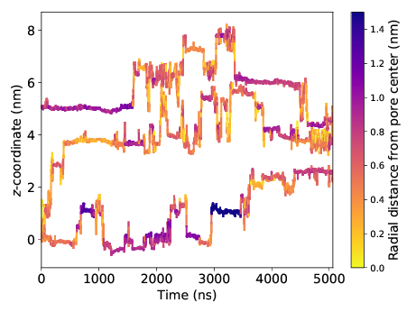

.. _z-trace:

Plot Coordinate Versus Radial Position
========================================

Sometimes it's useful to visualize the center-of-mass trajectory for single
residues alongside their radial position with respect to the pore centers. A
plot of a z-coordinate trace might look like the following:

This plot is very information-rich. It tells us that solutes like to make
intermittent jumps between periods of entrapment. It also suggests that solute
are prone to trapping when far from the pore center (i.e. in the tails).

:code:`coordinate_trace.py` is probably best used from the :ref:`command line
<command-line-ztrace>`, however its :ref:`classes <ztrace-classes>` are
documented below to provide the user more control.

.. _command-line-ztrace:

======================
Command Line Interface
======================

.. argparse::
   :filename: ../LLC_Membranes/timeseries/coordinate_trace.py
   :func: initialize
   :prog: coordinate_trace.py

.. _ztrace-classes:

========
Classes
========

.. autoclass:: coordinate_trace.CoordinateTrace
   :members: __init__, locate_pore_centers, radial_distances, plot_trace
