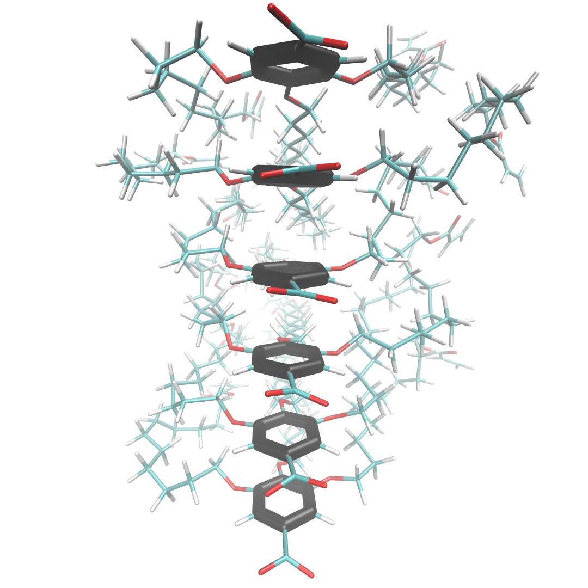
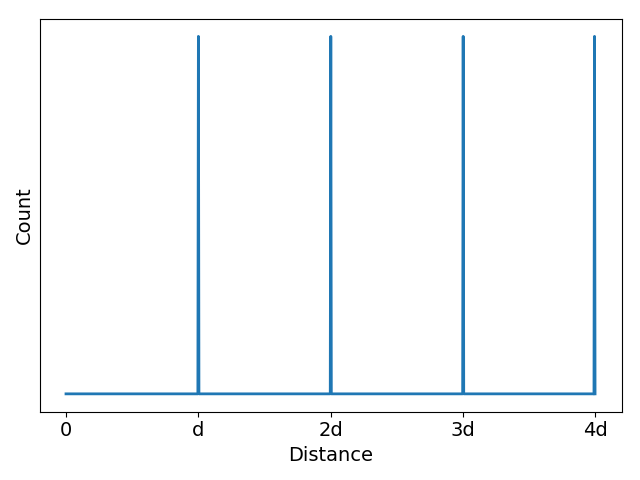
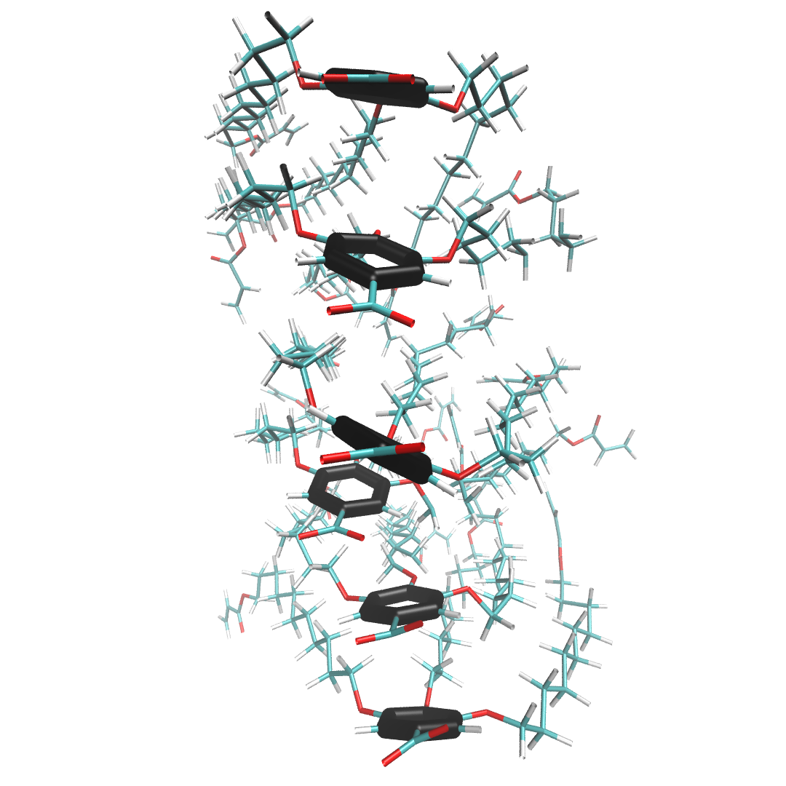
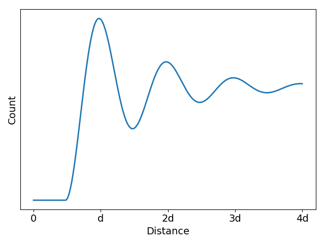

Correlation Functions
=============================

A correlation function is a measure of order in a system. It's main purpose is to determine the spatial relationship between a single atom or group of atoms to other surrounding atoms or groups of atoms.

To understand the expected output of a correlation function calculation, it is easiest to start with a 1D example.

In scenario 1 below, liquid crystal monomers are stacked in a perfect column. The distance, d, between the center of mass of each head group (head group atoms are highlighted black) is exactly the same in all cases. The associated z-direction (the z-axis runs in the same direction that the monomers stack) correlation function shows equally spaced, equally intense, sharp spikes located at d, 2d, 3d ...

|pic1| |pic2|

In the more realistic scenario 2, shown below, the liquid crystal monomers are still stacked in a column, but the head groups are far less ordered. The peaks of the correlation function broaden in response to this disorder, but their maxima are still located at about the same place as scenario 1. The amplitudes of the maxima, however, decays exponentially. The exponent describing this decay is related to the **correlation length** of the system which is a measure of the distance at which two particle positions are no longer correlated. 

|pic3| |pic4|

=======
Classes
=======

.. autoclass:: correlation_function.Correlation
   :members: __init__, calculatate_correlation_function, make_slice, plot_slice

=========
Examples
=========

.. code-block:: python

   # imports
   from LLC_Membranes.analysis import correlation_function 

.. code-block:: python

   # The most basic usage

   g = correlation_function.Correlation(gro, trajectory=traj, res=residue_name)
   g.calculate_correlation_function()
   g.make_slice(axis)

.. code-block:: python

   # Correlation function of center of mass of a group of atoms

   atoms = ['C', 'C1', 'C2', 'C3', 'C4', 'C5']  # name of carbon atoms in the monomer head group
   g = correlation_function.Correlation(gro, trajectory=traj)
   g.calculate_correlation_function()
   g.make_slice(axis)

==========================
Command Line Functionality
==========================

.. argparse:: 
   :filename: ../LLC_Membranes/analysis/correlation_function.py
   :func: initialize
   :prog: correlation_function.py

=============
Example Usage
=============

.. code-block:: bash

   # Basic usage
   correlation_function.py -t trajectory.trr -g coordinates.gro -r residue

.. code-block:: bash

   # Correlation function of head group centers of mass
   # C C1 C2 C3 C4 and C5 are head group constituent atoms
   correlation_function.py -t trajectory.trr -g coordinates.gro -r residue -a C C1 C2 C3 C4 C5 

