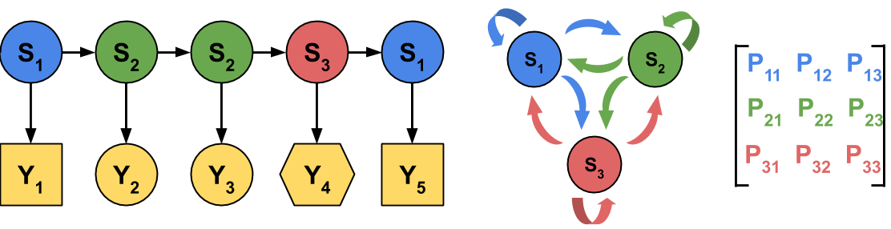
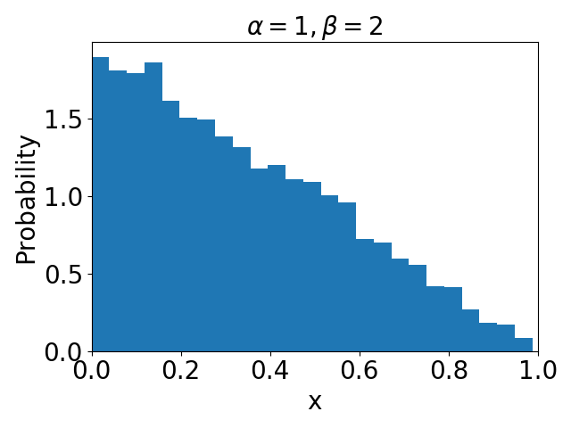
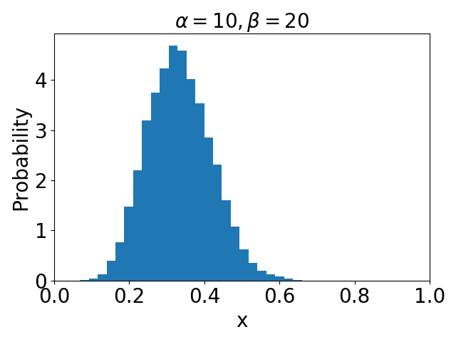
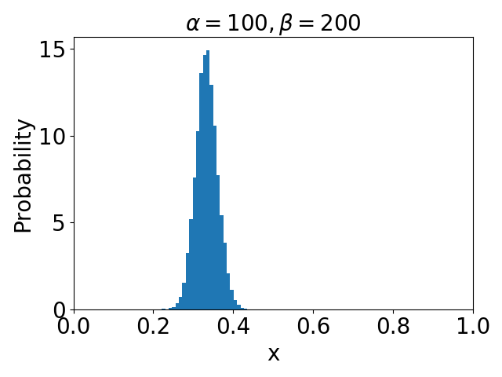
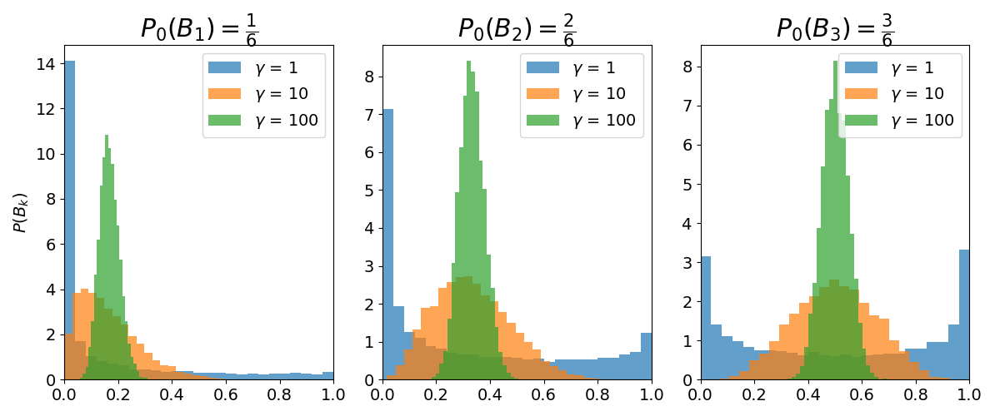

.. _hdphmm:

The Infinite Hidden Markov Model
================================

Proper use of the python tools below requires some knowledge of the inner
workings of the infinite hidden Markov Model (iHMM). I recommend reading at
least the following background and ideally some of the listed references
before using the code.
 
:ref:`I already know how this works, skip to the real documentation. <ihmm-implementation>`

Hidden Markov Models
--------------------

A standard hidden Markov model (HMM) is used to infer the hidden (or latent)
states of a system given data observations (see Figure below). Methods exist
which allow one to determine the maximum likelihood latent state sequence from
the data and then map them back to a matrix which describes the probability of
transitioning between the latent states. The main drawback to this approach is
that the number of latent states must be known beforehand.

   (left) A process which can be described as an HMM produces observations (Y) that are emissions dependent on some sequence of hidden states (S). The type of emissions (illustrated as different shapes here) helps determine the likelihood of the hidden state which produced that emission. (center) There is an associated probability with transitioning between hidden states. In the above image, if a system started in state 1, it is possible to transition from state 1 to state 2, from state 1 to state 3 or or to remain in state 1. (right) The probabilities of transitions between states are typically stored in a probability transition matrix where each entry, P\ :sub:`ij` \, describes the probability of transitioning from state i to state j given that the system is already in state i.

There are a number of python tools that have already implemented HMMs. If you
already know the number of states, I recommend starting with them:

* `pomegranate <https://pomegranate.readthedocs.io/en/latest/>`_ : In addition to HMMs, implements a number of related probabilistic models.
* `PyEmma <http://emma-project.org/latest/>`_ : Tools for constructing Markov State Models using molecular dynamics data.
* `MSMBuilder <http://msmbuilder.org/3.8.0/>`_ : Similar to PyEmma

The infinite hidden Markov model
--------------------------------

The infinite hidden Markov model (iHMM), also called the hierarchical Dirichlet
process hidden markov model (HDPHMM), does not require the number of states to
be known. It uses a Dirichlet process prior in order to make guesses at the 
rows of the probability transition matrix with shape :math:`\infty \times \infty`.
Of course, in practice, we are not going to be doing math on an infinite sized 
matrix. Instead one can choose matrix dimensions that are big enough that all
hidden states will be identified. This may require some experimentation.

The Dirchlet Distribution and Dirichlet Processes
*************************************************

Before going too far, it is important to understand the Dirichlet distribution
and the Dirichlet process that follows. A dirichlet distribution is simply 
a multivariate generalization of the beta distribution. The beta distribution is
given by: 

.. math::

   f(x; \alpha, \beta) = \frac{\Gamma(\alpha + \beta)}{\Gamma(\alpha)\Gamma(\beta)}x^{\alpha - 1}(1 - x)^{\beta - 1}

Let's plot some draws from the beta distribution:

|pic1| |pic2| |pic3|

In the above figures, I held the ratio of :math:`\alpha` to :math:`\beta` at
:math:`\frac{1}{2}`. Note that as I increase the magnitude of each parameter, 
the distribution narrows around :math:`\frac{\alpha}{\alpha + \beta}`. 

One can rewrite the beta distribution as: 

.. math::

   f(x_1, x_2; \alpha_1, \alpha_2) = \frac{\Gamma(\alpha_1 + \alpha_2)}{\Gamma(\alpha_1)\Gamma(\alpha_2)}x_1^{\alpha_1 - 1}x_2^{\alpha_2 - 1}

where :math:`\alpha_1 = \alpha, \alpha_2 = \beta; x_1 = x; x_2 = 1 - x_1`. The
sum of :math:`x_1` and :math:`x_2` will always equal 1. With the above formulation of 
the beta distribution, it is easy to see how it generalizes to the Dirichlet
distribution:

.. math::

   f(x_1, \cdots, x_k; \alpha_1, \cdots, \alpha_k) = \frac{\Gamma(\sum_{h=1}^k \alpha_i)}{\prod_{h=1}^k\Gamma(\alpha_i)}\prod_{h=1}^k x_i^{\alpha_i -1}

Just as with the beta distribution, the sum of all :math:`x_i` randomly drawn
from a Dirichlet distribution equals 1. The ratio
:math:`\frac{\alpha_i}{\sum_{h=1}^k \alpha_h}` represents the center of the
marginal distribution for each :math:`x_i`. The magnitude of the :math:`\alpha`
values controls the width of the marginal distributions.

A Dirichlet process (DP) is realized simply by making random draws from the
Dirichlet distribution. They are interesting because realizations of Dirichlet
processes are *distributions* rather than scalars. 

Let's say that we learned some information about a probability distribution
which we describe by grouping some observed data into three bins. Based on six
empirical measurements, the bin heights are [1, 2, 3] meaning the empirical
probability density, :math:`P_0`, is [:math:`\frac{1}{6}`, :math:`\frac{2}{6}`,
:math:`\frac{3}{6}`].  The empirical probability density that we measured is
almost certainly not the same as the true distribution, :math:`P`, but it turns
out that the DP is a fully specified prior distribution for :math:`P`:

.. math::

   P(B_1), \cdots, P(B_k) \sim Dirichlet(\gamma P_0(B_1), \cdots,\gamma P_0(B_k))

where :math:`B_k` are the bin values of the probability density. So now we can
get a better idea of what :math:`P` might look like:

Analogous to what we saw when we increased the magnitude of :math:`\alpha` and
:math:`\beta` in the beta distribution, the centers of the marginal
distributions created by draws from a DP narrow around the empirically measured
bin values (:math:`P_0(B_k)`) as :math:`\gamma` increases. :math:`\gamma` is
often thought of in terms of the confidence that you have in your initial or
*base* distribution.  If you have high confidence, :math:`\gamma` is high and
your marginal distributions are narrow. Usually this confidence is about equal
to the number of observations. So for the simple example above,
:math:`\gamma=6`.

The Stick-Breaking Construction
*******************************
.. this could use an illustration
The stick-breaking construction can be a useful way to visualize draws from a
Dirichlet process, :math:`DP(\gamma P_0)`. First, draw :math:`k` samples from
the base distribution :math:`P_0`. We will call these draws :math:`\theta_k`.
Often, :math:`P_0` is a continuous distribution so it is worth noting that a
draw from a DP is a discrete distribution. Now consider the act of breaking a
stick at a random fraction of its length. We will choose that random location
by drawing from a :math:`Beta(1, \gamma)` distribution. Now that process is
repeated :math:`n` times, breaking off pieces of the remainder of the stick.
Technically, :math:`k` is infinity but we can just say that the remaining
segments are all contained in the last segment broken off. This is important
for computational reasons. At the end of the process, the stick is segmented
into :math:`k` pieces. For each segment, :math:`k`, the fraction representing
the length of segment :math:`k` against the total length of the stick will be
called :math:`\beta_k`. Directly from this we can now write:

.. math::

   G_0 = \sum_{k=1}^{\infty}\beta_k\delta_{\theta_k}

where 

.. math::

   \theta_k \sim P_0; G_0 \sim DP(\gamma P_0)

In summary, we use a stick breaking process in order to obtain weights,
:math:`\beta_k`, which are multiplied by random draws from the base
distribution, :math:`P_0`, in order to create a discrete distribution,
:math:`G_0`, drawn from a DP. This procedure will give you the same kind of 
results that one could obtain with :code:`numpy.random.dirichlet`.

Using a DP to Create a Transition Matrix
****************************************

The DP is well-suited to sample the *rows* of the probability transition
matrix, :math:`T`, of the HMM process. The transition probabilities in each row
must sum to unity. If we had a good guess as to which state each observations
came from, we can empirically create a row of the transition matrix and use a
DP to sample the row of the transition matrix from the posterior. With enough
data (effectively :math:`\gamma` above), we have high confidence in our
posterior. Usually, you have no knowledge of the true state sequence. In this
case, one can assume some initial distribution, like a uniform distribution.
.. p 565 from Owen's book talks about HDPs

Unfortunately, one cannot simply sample each row of :math:`T` independently 
and hope to eventually arrive at the correct transition probabilites. Each row
is dependent on the others. This is where the hierarchical DP (HDP) becomes
necessary. 

In practice, you will likely never encounter a situation where an unwieldy
number of states are found because sampling from a Dirichlet process benefits
from a "rich get richer"-type algorithm. By this, I mean that emissions tend to
get assigned to states that already exist. An easy way to visualize this is 
through something called the stick-breaking construction. 
  
.. _ihmm-implementation:

=======
Classes
=======

.. autoclass:: infinite_hidden_markov_model.InfiniteHMM
   :members: __init__, inference, summarize_results

======================
Command Line Interface
======================

.. argparse:: 
   :filename: ../LLC_Membranes/machine_learning/infinite_hidden_markov_model.py
   :func: initialize
   :prog: infinite_hidden_markov_model.py

