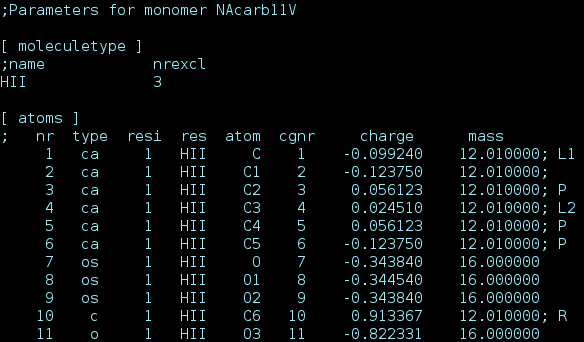
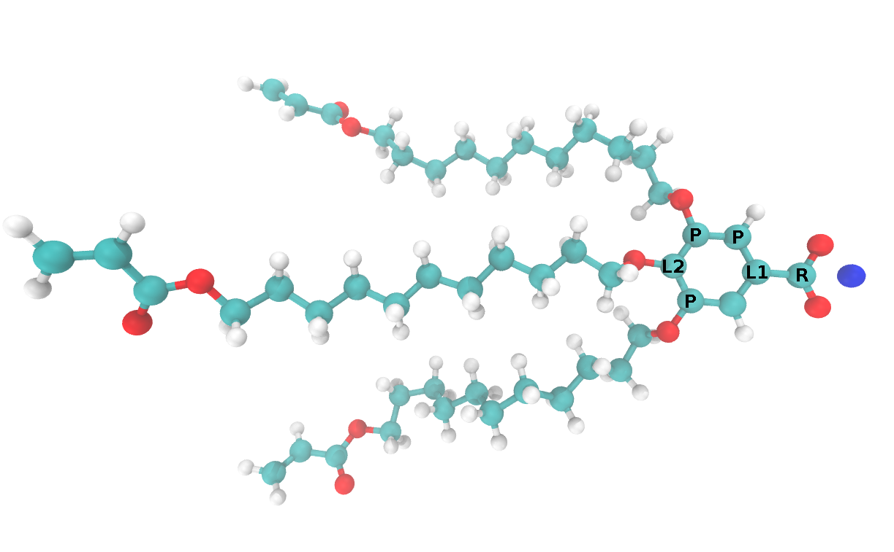

Preparation of Liquid Crystal Monomers
======================================

Very specific information about the monomer topology is needed 
for most of the scripts in this package. For example, when 
building a unit cell, how does one decide which part of the 
liquid crystal monomer to orient towards the pore center. The 
simple answer is to pass, as an argument, the atoms which should
be pointed towards the pore center. This approach becomes rather
clunky and error-prone as we begin to screen large amounts of 
monomers. 

We believe it is the best practice to define atoms or groups of 
atoms needed for a specific type of calculation just one time.
That is why we added annotations as an extra dimension to GROMACS
topologies which is only parsed by our scripts. Comments in the
GROMACS .itp files with specific codes help define extra
attributes about specific liquid crystals monomers.

Proper annotation of these attributes is illustrated below:

   Screen capture of the .itp file created for the monomer pictured above

.. _annotation-table:

Summary of Annotations
-----------------------

+-------+--------------------------------------------+-----------------------------+
|Symbol | Description                                |  More info                  |
+=======+============================================+=============================+
|P      | Atoms that define monomer plane            |  :ref:`build-annotations`   |
+-------+--------------------------------------------+-----------------------------+
|L1     |Atom, closest to pore center, used to define|  :ref:`build-annotations`   |
|       |the vector pointing from the monomer to the |                             |
|       |pore center                                 |                             |
+-------+--------------------------------------------+-----------------------------+
|L2     |Atom, furthest from the pore center, used to|  :ref:`build-annotations`   |
|       |define the vector pointing from the monomer |                             |
|       |to the pore center                          |                             |
+-------+--------------------------------------------+-----------------------------+
|R      |Reference atom. The distance from this atom |  :ref:`build-annotations`   |
|       |to the pore center defines the radius of the|                             |
|       |initial configuration                       |                             |
+-------+--------------------------------------------+-----------------------------+
|C1     |Carbon to be cross-linked                   |  :ref:`xlink-annotations`   |
+-------+--------------------------------------------+-----------------------------+
|C2     |Carbon to be cross-linked                   |  :ref:`xlink-annotations`   |
+-------+--------------------------------------------+-----------------------------+
|H      |Specifies a hydrogen that can participate in|  :ref:`hbond-annotations`   |        
|       |a hydrogen bonding interaction              |                             |
+-------+--------------------------------------------+-----------------------------+
|D      |Specifies a hydrogen bond donor atom        |  :ref:`hbond-annotations`   |
+-------+--------------------------------------------+-----------------------------+
|A      |Specifies a hydrogen bond acceptor atom     |  :ref:`hbond-annotations`   |
+-------+--------------------------------------------+-----------------------------+
|PDA    |Atoms whose center of mass is used to locate|                             |
|       |the center of the pores                     |                             |
+-------+--------------------------------------------+-----------------------------+

.. _build-annotations:

Unit Cell Construction
--------------------------------------

Parmeterized monomers
are usually randomly oriented in space. There are three pre-processing
steps that take place before building a unit cell. We will consider
them in the context of the specific monomer shown below, but the 
principles apply to any monomers used to build an HII phase unit cell:

#.  We must define a plane through the monomer which should be coplanar with the :math:`xy` plane in the initial configuration. Monomers will be stacked into columns perpendicular to this plane. Taking advantage of the :math:`sp2` hybridization which gives rise to the planar phenyl group, the 3 atoms labeled **P** are used to define this plane. Any 3 atoms in the ring would suffice for this purpose.
#.  We must select a reference atom which defines the pore radius, :math:`r`. The "pore radius" of a given initial configuration is defined based on the distance of the reference atom from the pore center. The atom labeled **R** is used as the reference atom in this case.
#.  Using monomer constituent atoms, we must define a vector that we always want to point directly away from the pore center. During the build procedure, monomers are translated to the origin, then translated a distance, `r` in the direction of this vector. In this case, the vector is defined by the subtraction of the coordinates of **L1** from **L2**.

.. _xlink-annotations:

Cross-linking
----------------------------

There is no automatic way to determine which atoms of a monomer will
participate in a cross-linking reaction. Instead, we must decide for
ourselves which atoms will be involved with the reaction.

.. _hbond-annotations:

Hydrogen Bonding
----------------

In order to identify hydrogen bonds in a trajectory, one must specify which
hydrogen atoms are able to participate in such an interaction as well as which
atoms are hydrogen bond donors and which are hydrogen bond acceptors.
